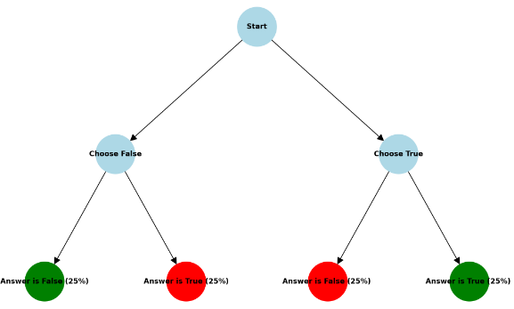

# **The Inexistence of a Superior Strategy When You Have No Indicator of Any Right Answer in a Test**

## **Abstract**

This document demonstrates why no single strategy is superior when dealing with 10 unknown answers in a test. Understanding this concept is crucial in the study of probabilities and statistics, as it illustrates how mathematical principles, though sometimes counterintuitive, are the best tools for predicting outcomes.

## **Introduction**

In probability and statistics, understanding the likelihood of various outcomes is essential. When faced with a test containing unknown answers, one might wonder if a particular guessing strategy could outperform others. This research explores this question by demonstrating that no single strategy is superior when dealing with 10 unknown answers in a test. This conclusion is supported by Monte Carlo simulations and a mathematical proof based on probabilities.

## **Monte Carlo Simulations**

Monte Carlo simulations are a powerful tool for understanding probabilistic events by running a large number of random trials. In this study, we employ Monte Carlo simulations to analyze different guessing strategies for a test with 10 questions, each having an unknown answer.

Methodology:
1\. Generate a random number between 0 and 2^{10} - 1 and convert it to binary format to represent the correct answers for the test. Each binary digit (0 or 1) corresponds to False or True, respectively.
2\. Generate another random number in the same range and convert it to binary format to represent a random test taker's answers.
3\. Compare the test taker's answers to the correct answers.
4\. Evaluate the strategies of always guessing False (0000000000) and always guessing True (1111111111).
5\. Repeat the simulation 1,000,000 times to gather sufficient data for statistical analysis.

Results:
The results of the simulation are visualized in three histograms. Each histogram conveys a binomial distribution of scores ranging from 0 to 10, with an average score of 5 and a standard deviation of approximately 1.57. The sample size for the simulation is 1,000,000 trials for each strategy.

sample run of the simulation

\- Histogram 1: Distribution of scores when the strategy is to always guess True.
\- Histogram 2: Distribution of scores when the strategy is to always guess False.
\- Histogram 3: Distribution of scores when answers are Random.

Each histogram shows that the distribution of scores is centered around 5, illustrating that no single strategy significantly outperforms the others.

Analysis:
The histograms show that the average scores for both strategies (all False and all True) are statistically similar to the scores obtained from random guessing. This reinforces the idea that no single strategy is superior when the answers are unknown.

## **Mathematical Proof Using Probabilities**

To further substantiate the simulation results, we present a mathematical proof using probabilities.

Proof:
For each question in the test, there are four possible outcomes:
1\. You choose False, the correct answer is True.
2\. You choose False, the correct answer is False.
3\. You choose True, the correct answer is True.
4\. You choose True, the correct answer is False.

Each of these outcomes has an equal probability of 25%. If you choose all True, the outcomes are:
\- You choose True, the correct answer is False (50% probability).
\- You choose True, the correct answer is True (50% probability).

If you choose all False, the outcomes are:
\- You choose False, the correct answer is True (50% probability).
\- You choose False, the correct answer is False (50% probability).

Since the probabilities of each outcome are identical regardless of the strategy chosen, it follows that no single strategy is superior when the answers are unknown.

## **Calculation of Standard Deviation**

The standard deviation (SD) formula for a binomial distribution is:

\[ \sigma = \sqrt{n \cdot p \cdot (1 - p)} \]

Substituting the given values:

\[ \sigma^2 = 10 \cdot 0.5 \cdot (1 - 0.5) \]
\[ \sigma^2 = 10 \cdot 0.5 \cdot 0.5 \]
\[ \sigma^2 = 10 \cdot 0.25 \]
\[ \sigma^2 = 2.5 \]

Now, let's calculate the square root of 2.5 more accurately:

\[ \sqrt{2.5} \approx 1.5811388300841898 \]

So, the standard deviation for \( n = 10 \) trials with a 50-50 probability is approximately 1.58.

## **Standard Deviation Comparison and Randomness**

Standard Deviation Comparison:
The standard deviation (SD) calculated for the binomial distribution is approximately 1.58. This closely matches the SD observed from the Monte Carlo simulations, which is also around 1.57.

**_Why the Difference?_**

Although the calculated SD and the SD from the Monte Carlo simulations are very similar, a minor difference exists. This difference can be attributed to the fact that the JavaScript **\*`Math.random`** function is not truly random.\* It generates pseudo-random numbers based on an algorithm. While these numbers are sufficient for most simulations and practical purposes, they do not achieve true randomness. The limitations of `Math.random` include:
\- **Predictability**: Given the same initial seed, `Math.random` will produce the same sequence of numbers.
\- **Uniformity:** While designed to be uniformly distributed, slight biases can occur over many iterations.

Despite these shortcomings, `Math.random` is adequate for our simulation, providing a sufficiently random distribution of test outcomes for the purpose of illustrating the concept.

## **Conclusion**

This study demonstrates that no single guessing strategy is superior when dealing with 10 unknown answers in a test. Both Monte Carlo simulations and a mathematical proof confirm that all strategies fall under the same logic, with each question having a 50% chance of being correct or incorrect, irrespective of the chosen strategy. This finding highlights the importance of probabilistic thinking in understanding outcomes that may initially seem counterintuitive.
